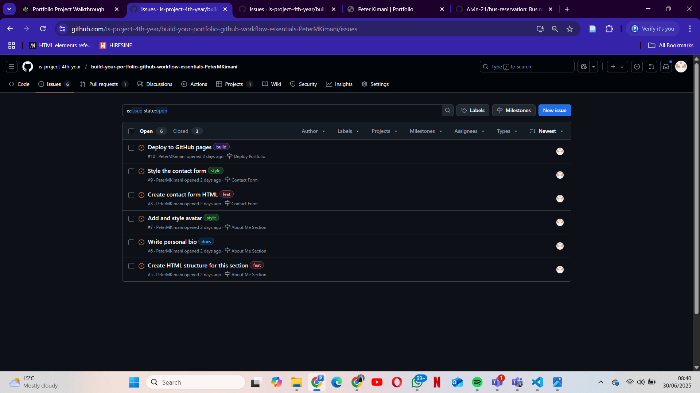
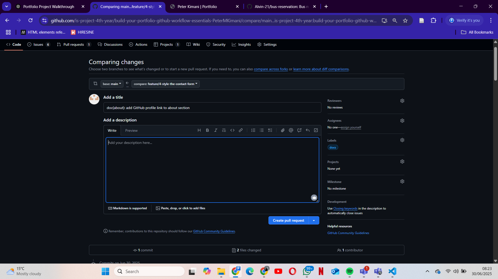

# Personal Portfolio Documentation

## 1. Student Details

- **Full Name**: Peter Kimani 
- **GitHub Username**: PeterMKimani
- **Email**: njau.kimani@strathmore.edu

## 2. Deployed Portfolio Link

- **GitHub Pages URL**:  
  https://is-project-4th-year.github.io/build-your-portfolio-github-workflow-essentials-PeterMKimani/

## 3. Learnings from the Git Crash Program

  **Branching**: Helped me separate different features like the navbar and hero section, allowing me to work on them independently without affecting the main project. This kept the development organized and conflict-free.

  **Commit Messages**: I learned how to write clear, meaningful commit messages using conventional formats like feat, fix, and docs. This made it easier to track changes and understand the history of the project.

  **Pull Requests**: I understood how to open pull requests to propose changes, review code, and safely merge feature branches into main. This made collaboration smoother and reduced the chances of bugs slipping through.

  **GitHub Pages Deployment**: I learned how to deploy my portfolio directly from a GitHub branch, which helped me see live updates of my site and share it easily with others for feedback.

## 4. Screenshots of Key GitHub Features

  
*This screenshot shows the creation of a new feature branch from the terminal. It helped me separate work on different sections of the project like the navbar and hero.*

  
*This screenshot displays a pull request I made to merge a feature branch into the main branch. I used PRs to review changes and avoid conflicts.*

  
*Here is the commit history showing clear, structured messages using conventional commits like `feat`, `fix`, and `docs`, which made it easier to track project progress.*

  
*This screenshot shows how I configured GitHub Pages to host my portfolio site from the `main` branch, making it accessible online.*

### A. Milestones and Issues

### B. Project Board

### C. Branching

### D. Pull Requests

### E. Merge Conflict Resolution

- Screenshot of a resolved merge conflict (in a pull request, commit history, or your local terminal/GitHub Desktop).
